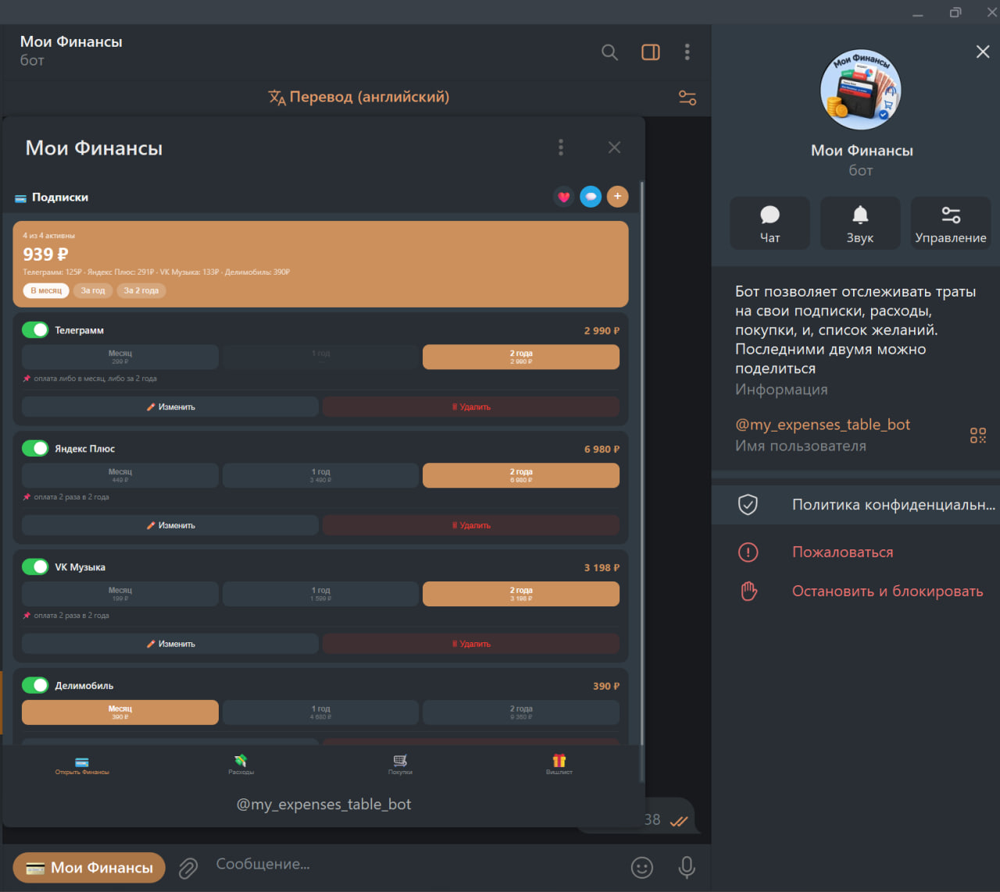
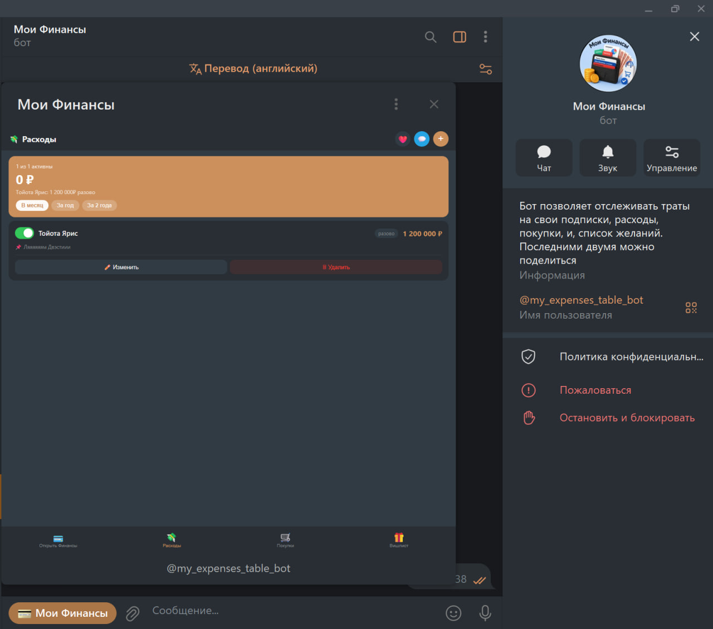
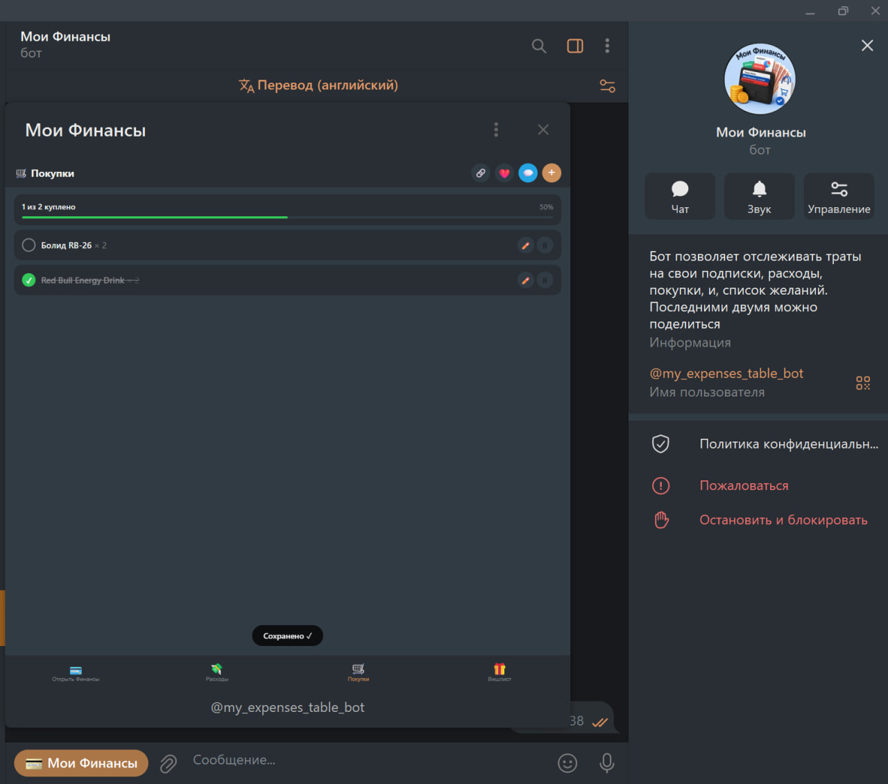

# -my_expenses
💰 Мои финансы — Telegram Mini App

[](https://github.com/ChizaySpeak)
[](https://t.me/my_expenses_table_bot)
[](https://opensource.org/licenses/MIT)

**Мои финансы** — это простое и красивое мини-приложение для Telegram, которое помогает управлять личным бюджетом, отслеживать подписки, планировать покупки и собирать вишлист.  
Приложение полностью работает внутри Telegram, адаптируется под тему устройства и сохраняет все данные в облаке Telegram (или локально).

🔗 **Попробовать**: [https://github.com/ChizaySpeak/-my_expenses](https://github.com/ChizaySpeak/-my_expenses)

---

✨ Возможности

- 💳 **Управление подписками**  
  – Добавляйте сервисы (например, Яндекс Плюс, Spotify).  
  – Указывайте цены за месяц, год или 2 года.  
  – Автоматический пересчёт расходов за выбранный период.

- 💸 **Регулярные расходы**  
  – Фиксируйте траты с разной периодичностью: месяц, неделя, год, разово.  
  – Быстро отключайте ненужные расходы тумблером.

- 🛒 **Список покупок**  
  – Добавляйте товары с количеством, заметками и фото.  
  – Отмечайте купленное — прогресс отображается наглядно.  
  – Делитесь списком через ссылку или текстом: получатель может интерактивно отмечать купленное.

- 🎁 **Вишлист с бронированием**  
  – Создавайте список желаемых подарков с фото, ценой, приоритетом.  
  – Скрывайте цену или целый подарок от получателя.  
  – Друзья могут «забронировать» подарок по ссылке, а вы увидите, кто и что выбрал.

- 🔗 **Общий доступ**  
  – Поделиться списком покупок или вишлистом можно одной ссылкой.  
  – Получатель открывает интерактивную версию прямо в Telegram.

- 💖 **Поддержка проекта**  
  – Кнопка доната на Boosty с сердечком ❤️ в шапке.  
  – Кнопка перехода в Telegram‑канал 💬 для новостей и обновлений.

- 🌙 **Адаптация под тему Telegram**  
  – Автоматически подхватывает светлую или тёмную тему.  
  – Все цвета, отступы и шрифты соответствуют нативному интерфейсу Telegram.

- ☁️ **Сохранение в облаке**  
  – Данные хранятся в `Telegram.CloudStorage` и синхронизируются между устройствами одного пользователя.

---

🖼️ Скриншоты


| Подписки | Расходы | Список покупок |
|----------|---------|----------------|
  |  |  |

---

🛠 Технологии

- **HTML5 / CSS3 / JavaScript** — чистый фронтенд, без фреймворков.
- **Telegram WebApp SDK** — интеграция с мессенджером (`tg.ready()`, `tg.openLink`, `CloudStorage`).
- **GitHub Pages** — хостинг готового приложения.
- **Boosty** — приём донатов.
- **Telegram CloudStorage** — персональное облачное хранилище данных.

---

🚀 Быстрый старт (для себя или своего бота)

1. **Скопируйте репозиторий**  
   ```bash
   git clone https://chizayspeak.github.io/-my_expenses/

    Настройте ссылки (опционально)
    – В файле index.html найдите строчку openDonateLink() и замените 'https://boosty.to/chizzayspeak/donate' на вашу ссылку Boosty.
    – В функции openChannel() замените 'https://t.me/ваш_канал' на адрес вашего Telegram-канала.

    Запустите локально
    Просто откройте index.html в браузере — все данные будут сохраняться в localStorage.
    Для тестирования в Telegram используйте бот и укажите ссылку на ваш GitHub Pages.

    Выложите на GitHub Pages
    – В настройках репозитория включите GitHub Pages (ветка main, папка /root).
    – Готово! Приложение доступно по адресу: https://dmitroberezukk.github.io/-my_expenses/.

🔧 Настройка Telegram‑бота (для публичного доступа)

    Создайте бота через @BotFather.

    Получите токен и установите команды:
    text

    start — открыть приложение

    Настройте кнопку Web App в меню бота:
    text

    /setuserpic — загрузите иконку
    /setdomain — добавьте ваш GitHub Pages URL в белый список
    /setinline — (по желанию)

    Готово! Теперь бот может открывать ваше мини‑приложение.

🤝 Вклад в проект

Если вы нашли ошибку или хотите предложить улучшение:

    Создайте Issue с описанием.

    Отправьте Pull Request с вашими изменениями.

    Поддержите проект донатом через кнопку ❤️ в приложении или Boosty.

📄 Лицензия

Проект распространяется под лицензией MIT. Подробнее см. файл LICENSE (если его нет — вы можете добавить стандартный текст лицензии).
👤 Автор

Дмитрий Сергеевич
— Telegram: https://t.me/shoguns_notes
— Boosty: chizzayspeak

Спасибо за использование! Если приложение помогло вам навести порядок в финансах — поставьте ⭐ на GitHub и поделитесь с друзьями.
